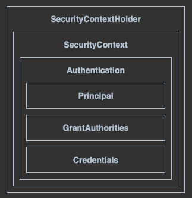
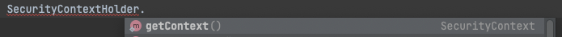
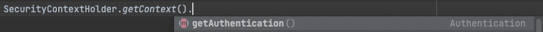
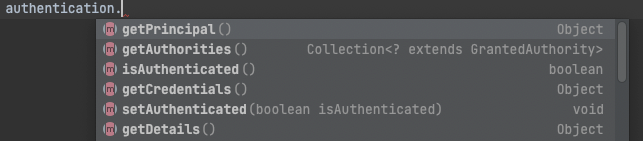
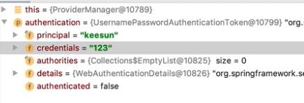
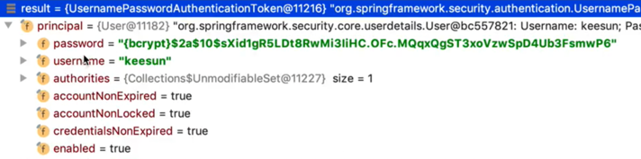

### 강의 주소
https://www.inflearn.com/course/백기선-스프링-시큐리티

## 학습 정리
### 3강 - 스프링 시큐리티 연동
pom.xml 등록
``` xml
<dependency>
    <groupId>org.springframework.boot</groupId>
    <artifactId>spring-boot-starter-security</artifactId>
</dependency>
```

### 4강 - 스프링 시큐리티 설정하기
SecurityConfig 클래스를 생성
``` java
@Configuration
@EnableWebSecurity
public class SecurityConifg extends WebSecurityConfigurerAdapter {
    @Override
    protected void configure(HttpSecurity http) throws Exception {
        http.authorizeRequests()
                .mvcMatchers("/", "/info").permitAll()
                .mvcMatchers("/admin").hasRole("ADMIN")
                .anyRequest().authenticated();
        http.formLogin();
        http.httpBasic();
    }
}
```
- WebSecurityConfigurerAdapter 를 상속 받는다.
- @Configuration 어노테이션 @EnableWebSecurity 어노테이션을 추가한다.
- @EnableWebSecurity은 없어도 스프링 부트 자동설정이 자동으로 추가해준다.

요청 URL 별로 인증하는 방법

1. nfigure(HttpSecurity http) 오버라이드
2. 요청 승인을 위한 http.authorizeRequests() 호출
3. mvcMatchers 또는  anyRequest 을 사용해서 요청을 구분할 수 있다.
    - .mvcMatchers("/", "/info") : url 패턴을 등록
    - .anyRequest() : mvcMatchers 요청을 제외한 모든 요청
    - 하위 메소드
        - .permitAll() : 접근을 모두 허용
        - .hasRole("ADMIN") : 인증이 필요, ADMIN 권한만 허용
        - .authenticated() : 인증 필요

### 5강 - 인메모리 유저 추가
하드하게 유저 정보를 추가하는 방법으로는 properties를 사용한 방법과 시큐리티 설정을 이용하는 방법이 있다.

#### properties를 사용하는 방법
``` properties
spring.security.user.name=admin
spring.security.user.password=123
spring.security.user.roles=ADMIN
```  

#### 시큐리티 설정에 추가하는 방법
1. SecurityConfig 에서 AuthenticationManagerBuilder auth를 제공하는 configure메소드를 오버라이드 한다.
2. auth.inMemoryAuthentication() 호출
    - 하위 메소드로 withUser(), password(), role() 을 사용하여 유저 정보를 추가 할 수있다.
``` java
@Override
protected void configure(AuthenticationManagerBuilder auth) throws Exception {
    auth.inMemoryAuthentication()
        .withUser("keesun").password("{noop}123").roles("USER").and()
        .withUser("admin").password("{noop}!@#").roles("ADMIN");
}
```
- {}안에 암호화 방법을 적는다.
    - noop은 스프링부트 기본 패스워드 인코더
        - 비밀번호 앞에 {noop} 프리픽스가 있으면 noop으로 패스워드를 인코딩 한다.

### 6강 - JPA 연동 / UserDetailService 구현
1. pom.xml 에 jpa, h2 추가
``` xml
<dependency>
    <groupId>org.springframework.boot</groupId>
    <artifactId>spring-boot-starter-data-jpa</artifactId>
</dependency>
<dependency>
    <groupId>com.h2database</groupId>
    <artifactId>h2</artifactId>
    <scope>runtime</scope>
</dependency>
```
3. Account 클래스, AccountRepository 클래스 추가 - 본 문서는 시큐리티 설명이 메인이므로 JPA 관련된 자세한 소스는 생략
4. UserDetailsService 인터페이스를 구현하는 AccountService 클래스 생성
``` java
@Service
public class AccountService implements UserDetailsService {

    @Autowired AccountRepository accountRepository;

    @Override
    public UserDetails loadUserByUsername(String username) throws UsernameNotFoundException {
        Account account = accountRepository.findByUsername(username);
        if (account == null) {
            throw new UsernameNotFoundException(username);
        }

        return User.builder()
                .username(account.getUsername())
                .password(account.getPassword())
                .roles(account.getRole())
                .build();
    }
}
```
- UserDetailsService : DAO를 사용해서 유저정보를 가져와서 인증할 때 사용되는 인터페이스, 즉 데이터베이스에서 유저 정보를 가져와서 인증할 때 사용된다.
- loadByUsername 메소드
    - username을 받아서 username에 해당하는 유저 정보를 DB에서 가져와서 UserDetails 타입(인터페이스 타입)으로 리턴하는 역할 수행
    - 스프링 시큐리티에서 제공하는 User 클래스를 사요하면 UserDetails로 쉽게 변환 할 수 있다.

### 7강 - PasswordEncoder
``` java
@Bean
public PasswordEncoder passwordEncoder() {
    return PasswordEncoderFactories.createDelegatingPasswordEncoder();
}
```
- PasswordEncoder는 스프링 시큐리티가 권장하는 방법이며, 다양한 암호화 알고리즘을 지원한다.
    - {id}를 사용하면 특정 포맷으로 암호화 한다.
    - ex) `passwordEncoder.encode("{sha256}비밀번호")`
- PasswordEncoder는 기본 전략이 예전에 NoOp을 사용했고 지금은 BCrypt를 사용한다.
    - 스프링 시큐리티 5.0 부터 BCrypt를 사용
    - ex) `passwordEncoder.encode("비밀번호")` -> 기본이 BCrypt 이므로 BCrypt로 암호화 된다.

### 8강, 9강 - 스프링 시큐리티 테스트
1. pom.xml 에 spring-security-test 추가
``` xml 
<dependency>
    <groupId>org.springframework.security</groupId>
    <artifactId>spring-security-test</artifactId>
    <scope>test</scope>
    <version>${spring-security.version}</version>
</dependency>
```
2. MockMvc를 사용해서 권한이 부여된 테스트 유저를 만들어서 특정한 URI로 접속했을 때 접근이 허용되는지 테스트를 할 수 있다.
     - with() 메소드를 사용한 방법
        <details>
        <summary>소스 보기</summary>
        <div>

        ``` java
        @RunWith(SpringRunner.class)
        @SpringBootTest
        @AutoConfigureMockMvc
        public class AccountControllerTest {
            @Autowired
            MockMvc mockMvc;
    
            @Test
            public void index_anonymous() throws Exception {
            mockMvc.perform(get("/").with(anonymous()))
                    .andDo(print())
                    .andExpect(status().isOk());
            }
    
            @Test
            public void index_user() throws Exception {
                mockMvc.perform(get("/").with(user("keesun").roles("USER")))
                        .andDo(print())
                        .andExpect(status().isOk());
            }
    
            @Test
            public void admin_user() throws Exception {
                mockMvc.perform(get("/").with(user("keesun").roles("USER")))
                        .andDo(print())
                        .andExpect(status().isForbidden());
            }
    
            @Test
            public void admin_admin() throws Exception {
                mockMvc.perform(get("/admin").with(user("keesun").roles("ADMIN")))
                        .andDo(print())
                        .andExpect(status().isOk());
            }
        }
        ```
        </div>
        </details>

    - 어노테이션을 사용한 방법
        <details>
        <summary>소스 보기</summary>
        <div>

        ``` java
        @RunWith(SpringRunner.class)
        @SpringBootTest
        @AutoConfigureMockMvc
        public class AccountControllerTest {
        @Autowired
        MockMvc mockMvc;
    
            @Test
            @WithAnonymousUser
            public void index_anonymous() throws Exception {
                mockMvc.perform(get("/"))
                        .andDo(print())
                        .andExpect(status().isOk());
            }
    
            @Test
            @WithMockUser(username = "keesun", roles = "USER")
            public void index_user() throws Exception {
                mockMvc.perform(get("/"))
                        .andDo(print())
                        .andExpect(status().isOk());
            }
    
            @Test
            @WithMockUser(username = "keesun", roles = "USER")
            public void admin_user() throws Exception {
                mockMvc.perform(get("/"))
                        .andDo(print())
                        .andExpect(status().isForbidden());
            }
    
            @Test
            @WithMockUser(username = "keesun", roles = "ADMIN")
            public void admin_admin() throws Exception {
                mockMvc.perform(get("/admin"))
                        .andDo(print())
                        .andExpect(status().isOk());
            }
        }
        ```
        </div>
        </details>

    - 커스컴 어노테이션을 만들어서 사용하기
        <details>
        <summary>소스 보기</summary>
        <div>

        ``` java
        @Retention(RetentionPolicy.RUNTIME)
        @WithMockUser(username = "keesun", roles = "USER")
        public @interface WithUser {

        }
        ```

        ``` java
        @RunWith(SpringRunner.class)
        @SpringBootTest
        @AutoConfigureMockMvc
        public class AccountControllerTest {
            @Autowired
            MockMvc mockMvc;

            @Test
            @WithAnonymousUser
            public void index_anonymous() throws Exception {
                mockMvc.perform(get("/"))
                        .andDo(print())
                        .andExpect(status().isOk());
            }

            @Test
            @WithUser
            public void index_user() throws Exception {
                mockMvc.perform(get("/"))
                        .andDo(print())
                        .andExpect(status().isOk());
            }

            @Test
            @WithUser
            public void admin_user() throws Exception {
                mockMvc.perform(get("/"))
                        .andDo(print())
                        .andExpect(status().isForbidden());
            }

            @Test
            @WithMockUser(username = "keesun", roles = "ADMIN")
            public void admin_admin() throws Exception {
                mockMvc.perform(get("/admin"))
                        .andDo(print())
                        .andExpect(status().isOk());
            }
        }
        ```
        </div>
        </details>
3. MockMvc를 사용해서 폼(로그인 폼 화면)으로 로그인 하는 경우를 테스트 할 수 있다.
   - formLogin() 을 사용한다.
        
       <details>
       <summary>소스 보기</summary>
       <div>
    
       ``` java
       @Test
       @Transactional
       public void login_success() throws Exception {
           String username = "keesun";
           String password = "123";
           Account user = this.createUser(username, password);
           mockMvc.perform(formLogin().user(user.getUsername()).password(password))
                   .andExpect(authenticated());
       }
    
       @Test
       @Transactional
       public void login_fail() throws Exception {
           String username = "keesun";
           String password = "123";
           Account user = this.createUser(username, password);
           mockMvc.perform(formLogin().user(user.getUsername()).password("12345"))
                   .andExpect(authenticated());
       }
    
       private Account createUser(String username, String password) {
           Account account = new Account();
           account.setUsername(username);
           account.setPassword(password);
           account.setRole("USER");
           return  accountService.createNew(account);
       }
       ```
       </div>
       </details>
   
### 10강 - SecurityContextHolder와 Authentication
#### SecurityContextHolder 구조



#### SecurityContextHolder
- SecurityContextHolder는 SecurityContext를 제공해 준다.
  - SecurityContext을 제공하는 기본적인 방법으로 ThreadLocal(한 쓰레드 내에서 공유하는 저장소)을 사용한다.

#### SecurityContext
- Authentication을 제공한다.

#### Authentication
- Principal과 GrantAuthority를 제공한다.

#### Principal 
- 인증된 사용자 정보를 나타낸다.
  - UserDetailsService에서 리턴한 **UserDetails 타입**의 객체이다.
  - 최종적으로는 UserDetails 구현체인 **User 타입**
- Principal은 Authentication 안에 담겨져 있다.

#### GrantAuthority
- Principal이 가지고 있는 "권한"을 나타낸다.
  - "ROLE_USER", "ROLE_ADMIN" 등
- 인증이 된 이후에 **인가와 권한**을 확인 하기 위해 사용된다.

#### Credentials
- 자격 증명을 나타냅니다. 예를 들면 password가 될 수 있습니다.

#### UserDetails 
- 애플리케이션이 가지고 있는 유저 정보와 스프링 시큐리티가 사용하는 Authentication 객체 사이의 어댑터.

#### UserDetailService
- 유저 정보를 UserDetails 타입으로 가져오는 DAO (Data Access Object) 인터페이스
- 구현은 마음대로 할 수 있다. 
- **UserDetails를 리턴 한다.**

#### 실습 코드
디버거를 사용해서 정보가 무엇 무엇이 있는지 확인해 본다.
``` java
Authentication authentication = SecurityContextHolder.getContext().getAuthentication();
Object principal = authentication.getPrincipal();
Collection<? extends GrantedAuthority> authorities = authentication.getAuthorities();
Object credentials = authentication.getCredentials();
boolean authenticated = authentication.isAuthenticated();
```

코드는 SecurityContextContext 하나만 기억하고 있으면 점을 찍어서 자동완성으로 쉽게 작성할 수 있다.
 

 




### 12강 - AuthenticationManager와 Authentication
인증이 어떻게 이루어지고, 그 인증이 이루어지는 과정에 어떠한 일들이 벌어질수 있는지를 살펴본다.
#### AuthenticationManager 인터페이스
- 실제로 Authentication 을 만들고 인증을 처리한다.
- AuthenticationManager에는 authenticate 메서드 하나만 존재한다.
    ``` java
      Authentication authenticate(Authentication authentication) throws AuthenticationException;
    ```
  - authenticate 메소드에서 인자로 받는 authentication과 리턴하는 authentication의 차이
    - 인자로 받은 authentication 객체의 인증 정보가 유효하면 실제로 인증 처리된 authentication 객체를 리턴한다.
    - 실제로 인증된 authentication은 UserDetailsService가 리턴한 UserDetails 객체, 즉 principal 객체를 담고 있다.  
    - **인자 authentication**
      - 
    - **리턴 authentication**
      - 

- 기본 구현체는 ProviderManager 이다.
- ProviderManager 로 인증이 되는 과정
  - ProviderManager ==> 다른 Provider에 위임 ==> DaoAuthenticationProvider 에서 UserDetailsService의 loadUserByUsername 메서드를 호출한다.

### 12강 - ThreadLocal
- java.lang 패키지에서 기본적으로 제공하는 기능
- 쓰레드 범위 내에서 사용하는 변수
``` java
public class AccountContext {

    private static final ThreadLocal<Account> ACCOUNT_THREAD_LOCAL = new ThreadLocal<>();

    public static void setAccount(Account account) {
        ACCOUNT_THREAD_LOCAL.set(account);
    }

    public static Account getAccount() {
        return ACCOUNT_THREAD_LOCAL.get();
    }
}
```
- SecurityContextHolder 에서 getContext()로 SecurityContext를 꺼내오는 것과 같은 방법이다.

### 13강 - Authentication과 AuthenticationManager
AuthenticationManager를 통해서 인증을 마친 Authentication 객체가 언제 SecurityContextHolder 안으로 들어가는지 살펴본다.
- 크게 두가지의 Filter가 SecurityContextHolder에 Authentication 객체를 넣어준다.
  - **UsernamePasswordAuthenticationFilter**
    - 폼인증을 처리하는 시큐리티 필터이다. 
    - 인증된 Authentication객체를 SecurityContextHolder에 넣어준다.
  - **SecurityContextPersistenceFilter**
    - SecurityContext를 HTTP session에 캐시(기본 전략)하여 여러 요청에서 Authentication을 공유할 수 있도록 공유하는 필터이다.
    - 여러 요청시에도 **인증한 유저는 동일한 Authentication**을 갖을 수 있게 해준다.

#### 처리 순서
1. 요청이 이루어 진다.
2. SecurityContextPersisenceFilter는 캐싱하고 있는 SecurityContext를 읽어온다. 
3. 읽어온 SecurityContext을 SecurityCotextHolder에 넣는다.
4. UsernamePasswordAuthenticationFilter로 체인되어 인증이 이루어진다.
5. 인증이 성공하면 UsernamePasswordAuthenticationFilter의 부모 클래스인 AbstractAuthenticationProcessingFilter에 있는 successfulAuthentication 메소드가 실행 된다.
6. successfulAuthentication 메소드에서 최종적으로 authentication가 set된다.
    ``` java
    SecurityContext context = SecurityContextHolder.createEmptyContext();
    context.setAuthentication(authResult);
    SecurityContextHolder.setContext(context);
    ```
   
### 14강 - 시큐리티 Filter와 FilterChainProxy
#### 스프링 시큐리티가 제공하는 15개의 필터들
1. WebAsyncManagerIntegrationFilter
2. SecurityContextPersistenceFilter
3. HeaderWriteFilter
4. CsrfFilter
5. LogoutFilter
6. UsernamePasswordAuthenticationFilter
7. DefaultLoginPageGeneratingFilter
8. DefaultLogoutPageGeneratingFilter
9. BasicAuthenticationFilter
10. RequestCacheAwareFilter
11. SecurityContextHolderAwareRequestFilter
12. AnonymousAuthenticationFilter
13. SessionManagementFilter
14. ExceptionTranslationFilter
15. FilterSecurityInterceptor

- **FilterChainProxy**에서 위 필터들을 순차적으로 실행 시킨다.
- SecurityConfig 는 여러개 만들수 있으며 SecurityConfig 하나가 하나의 체인이다.
- 실행할 필터들의 목록이 만들어지는 곳은 SecurityConfig이다.
- SecurityConfig에서의 설정에 따라서 필터 갯수가 달라진다.

``` java
protected void configure(HttpSecurity http) throws Exception {
    http
        .antMatcher("/account/**")
            .authorizeRequests()
            .anyRequest().permitAll();
}
```
- 필터 갯수가 12개이다.

``` java
protected void configure(HttpSecurity http) throws Exception {
    http.authorizeRequests()
        .mvcMatchers("/", "/info", "/account/**").permitAll()
        .mvcMatchers("/admin").hasRole("ADMIN")
        .anyRequest().authenticated();
    http.formLogin();
    http.httpBasic();
}
```
- 필터 갯수가 15개이다.

### 15강 - DelegatingFilterProxy와 FilterChainProxy
요청을 했을 때 어떻게 FilterChainProxy 까지 들어가지는지 알아본다.

#### DelegatingFilterProxy
- 이름에서 암시하듯 자기가 처리를 하지 않고 다른 빈에게 위임을 하고 싶을 때 사용하는 서블릿 필터이다.
- 위임하기 위해서는 위임하려는 빈의 이름을 지정 해줘야된다.

FilterChainProxy은 DelegatingFilterProxy을 통해서 위임된다.
- AbstractSecurityWebApplicationInitializer 에서 'springSecurityFilterChain' 이라는 이름으로 위임된다.
``` java
String filterName = "springSecurityFilterChain";
DelegatingFilterProxy springSecurityFilterChain = new DelegatingFilterProxy(filterName);
```

### 16강 - AccessDecisionManager
지금까지는 인증(Authentication)을 다루는 부분을 쭉 살펴봤다면, 이제부터는 허가 (Access Control 또는 Authorization)을 다루는 인터페이스를 중심으로 살펴본다.
#### AccessDecisionManager
- 이미 인증을 거친 사용자가 특정한 서버의 리소스에 접근을 하려고 할 때 그것을 허용할 것인가, 그게 유용한 요청인가를 판단하는 인터페이스 이다.
- Access Control 결정을 내리는 인터페이스로, 구현체 3가지를 기본으로 제공한다.
  - **AffirmativeBased**: 여러 Voter 중에 한명이라도 허용하면 허용한다. (기본 구현체) 
    - 허용하지 않으면 Exception이 발생한다.
  - ConsensusBased: 다수결 (사용하는 경우가 흔하지 않다)
  - UnanimousBased: 만장일치
#### AccessDecisionVoter
  - 해당 Authentication이 특정한 Object에 접근할 때 필요한 ConfigAttributes를 만족하는지 확인한다.
      - 위에서 말한 특정한 Object라 함은 접근하려는 대상인 mvcMatchers("/admin") 등을 말하고
      - ConfigAttributes는 permitAll(), hasRole("xxx") 등을 말한다.
  - **WebExpressionVoter**
    - 웹 시큐리티에서 사용하는 기본 구현체이다.
    - ROLE_Xxxx가 매치하는지 확인한다.
  - RoleHierarchyVoter
    - 계층형 ROLE을 지원한다.
    - ex) ADMIN > MANAGER > USER

### 17강 - RoleHierarchy로 계층형 ROLE 설정 방법
``` java
public SecurityExpressionHandler expressionHandler() {
    RoleHierarchyImpl roleHierarchy = new RoleHierarchyImpl();
    roleHierarchy.setHierarchy("ROLE_ADMIN > ROLE_USER");

    DefaultWebSecurityExpressionHandler handler = new DefaultWebSecurityExpressionHandler();
    handler.setRoleHierarchy(roleHierarchy);

    return handler;
}

@Override
protected void configure(HttpSecurity http) throws Exception {
    http.authorizeRequests()
            .mvcMatchers("/", "/info", "/account/**").permitAll()
            .mvcMatchers("/admin").hasRole("ADMIN")
            .mvcMatchers("/user").hasRole("USER")
            .anyRequest().authenticated()
            .expressionHandler(expressionHandler());
    http.formLogin();
    http.httpBasic();
}
```